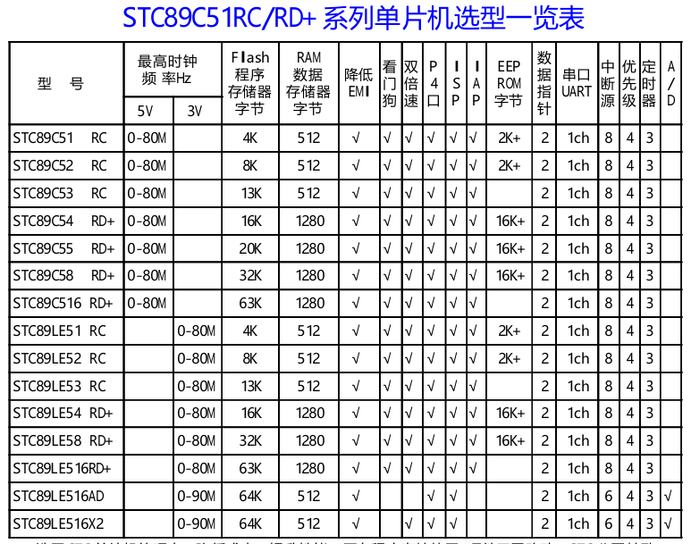
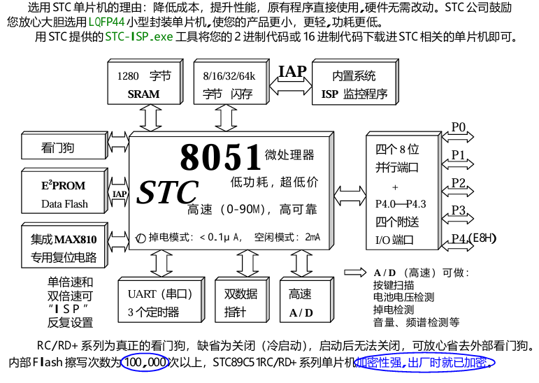

# wificar

	
	

基于ARM STC89C52单品机控制玩具小车，采用wifi局域网络与单片机串口建立通信方式实现控制玩具汽车

一、小车运动的基本原理
单片机小车运动的基本原理是通过电机驱动车轮转动，从而实现小车的前进、后退、左转、右转等运动。
以小车的前进为例，当小车电机转动时，电机传递的动力会被小车的车轮转化为机械能，从而推动小车向前运动。另外，为了保证小车直线行驶，需要两侧的电机运行速度保持一致。

二、小车的组成
单片机小车主要包括四个部分：电机、车轮、小车底盘以及电路控制板。
1.电机：电机是小车的动力来源，通过电机的转动来推动车轮运动。
2.车轮：车轮是传递小车动力的部件，通常是由橡胶或者聚氨酯材质制成，具有一定的弹性和防滑效果。
3.小车底盘：小车底盘是小车组装的底部固定部分，用于支撑和固定车轮和电机。
4.电路控制板：电路控制板是控制小车运动的核心部分，通常由单片机、驱动芯片、电源管理模块和传感器等组成。

三、控制小车的方法
单片机小车的控制方法，通常采用PWM控制驱动芯片的方式。具体控制流程如下：
1.根据需求，确定小车的运动方向(前进、后退、左转、右转等)。
2.通过单片机的IO口输出PWM信号控制驱动芯片，调节电机的转速。
3.驱动芯片控制电机正反转，并实现小车的运动。

此外，为了提高小车的控制精度，通常需要添加一些传感器和调节模块，如电位器、光电传感器、陀螺仪等，从而实现小车的避障或线追踪等功能。
